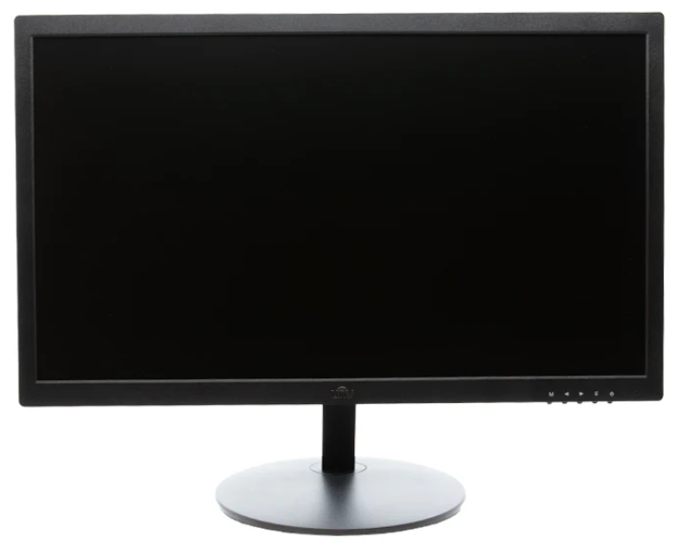

# CPE 487 Final Project - Grid Escape
**By: Atharva Shaligram and Sean Anderson**

A 2D platformer game designed in VHDL and displayed on a screen using an FPGA board and VGA connector

## Project Overview

The goal of this project was to create a 2D platformer game using a Nexys A7 board and VGA display. The project replicated common game mechanics from platformer games such as movement, collision detection, and attacking.

### Gameplay Win
[Gameplay Win Video](https://youtube.com/shorts/Zy052E8Qeeo)

### Gameplay Fail
[Gameplay Fail Video](https://youtube.com/shorts/NM_8QatdL1k)

### Game Timer Counter Video with LEDs
[Game Timer Counter Video with LEDs](https://youtube.com/shorts/LZx9jwMAcNc)

### Main Aspects of Grid Escape:

#### Map Creation:

- The start of the game generates and displays the map, player, and enemies (purple ghosts) on the screen.

- Brick wall boundaries are created with staircases, mushrooms, and a flag at the end.

#### Player Movement:

- Four buttons are the inputs for the player movement, which are BTNL to move left, BTNR to move right, BTNU to jump, and BTNC to attack.

- Gravity is always factored in for the player, so player can fall off platforms if there are open areas.

#### Collision Detection:

- Collision detection dictates player movement.
  
- When player collides with flag, game is reset

#### Game Timer:
- Time of game play and game completion time is kept track of.

## Expected Behavior

- When the game loads in, a map and player is generated and displayed on the screen.

  - Brick wall boundaries are created, with staircases, mushrooms, and a flag at end.

  - Purple ghosts are hovering over platforms.

- Player moves around the map.

- When player presses center button, they can attack and unalive enemies.

- Game time is kept track of.

### Block Diagram of Game Functionality


## Required Hardware
For the game to work, you will need the following:
- Nexys A7-100T FPGA Board
  
  
  
- Micro USB cable
  
  
  
- VGA Cable
  
  
  
- Monitor with VGA Port
  
  
  
- AMD Vivado™ Design Suite

## Setup
Download the following files from the repository to your computer:

Once you have downloaded the files, follow these steps:
1. Open **AMD Vivado™ Design Suite** and create a new RTL project called _Grid Escape_ in Vivado Quick Start
2. In the "Add Sources" section, click on "Add Files" and add all of the `.vhd` files from this repository
3. In the "Add Constraints" section, click on "Add Files" and add the `.xdc` file from this repository
4. In the "Default Part" section, click on "Boards" and find and choose the Neyxs A7-100T board
5. Click "Finish" in the New Project Summary page
6. Run Synthesis
7. Run Implementation
8. Generate Bitstream
9. Connect the Nexys A7-100T board to the computer using the Micro USB cable and switch the power ON
10. Connect the VGA cable from the Nexys A7-100T board to the VGA monitor
11. Open Hardware Manager
     - "Open Target"
     - "Auto Connect"
     - "Program Device"
12. Program should appear on the screen

## Module Hierarchy


## Inputs and Outputs

### `Game_Main.vhd`
```
ENTITY Game_Main IS
    PORT (
        clk_in : IN STD_LOGIC; -- system clock
        VGA_red : OUT STD_LOGIC_VECTOR (3 DOWNTO 0); -- VGA outputs
        VGA_green : OUT STD_LOGIC_VECTOR (3 DOWNTO 0);
        VGA_blue : OUT STD_LOGIC_VECTOR (3 DOWNTO 0);
        VGA_hsync : OUT STD_LOGIC;
        VGA_vsync : OUT STD_LOGIC;
        btnl : IN STD_LOGIC;
        btnr : IN STD_LOGIC;
        btnc : IN STD_LOGIC;
        btnd : IN STD_LOGIC;
        btnu : IN STD_LOGIC;
        SEG7_anode : OUT STD_LOGIC_VECTOR (7 DOWNTO 0); -- anodes of four 7-seg displays
        SEG7_seg : OUT STD_LOGIC_VECTOR (6 DOWNTO 0)
    ); 
END Game_Main;
```

#### Inputs
 - clk_in: System clock
 - btnl: Left Button, used to move left
 - btnr: Right Button, used to move right
 - btnc: Center Button, used to attack/unalive enemies
 - btnd: Down Button, used to reset the game
 - btnu: Up Button, used to jump
#### Outputs
 - VGA_red: Controls red output to VGA screen
 - VGA_green: Controls green output to VGA screen
 - VGA_blue: Controls blue output to VGA screen
 - VGA_hsync: Horizontal sync signal for VGA display
 - VGA_vsync: Vertical sync signal for VGA display
 - SEG7_anode: Controls the anodes of the 7-segment display
 - SEG7_seg: Controls the segments of the 7-segment display

### `tilemap_vga.vhd`
```
ENTITY tilemap_vga IS
    PORT (
        clk         : IN  STD_LOGIC;
        pixel_row   : IN  STD_LOGIC_VECTOR(10 DOWNTO 0);
        pixel_col   : IN  STD_LOGIC_VECTOR(10 DOWNTO 0);
        btnl        : IN STD_LOGIC;
        btnr        : IN STD_LOGIC;
        btnu        : IN STD_LOGIC;
        btnd        : IN STD_LOGIC;
        btnc        : IN STD_LOGIC;
        red         : OUT STD_LOGIC;
        green       : OUT STD_LOGIC;
        blue        : OUT STD_LOGIC;
        counter     : OUT STD_LOGIC_VECTOR(15 DOWNTO 0);
        new_last_score : OUT STD_LOGIC_VECTOR(15 DOWNTO 0)
    );
END tilemap_vga;
```

#### Inputs
 - clk: System clock
 - pixel_row: 
 - pixel_col:
 - btnl: Left Button, used to move left
 - btnr: Right Button, used to move right
 - btnc: Center Button, used to attack/unalive enemies
 - btnd: Down Button, used to reset the game
 - btnu: Up Button, used to jump
#### Outputs
 - red: Controls red output
 - green: Controls green output
 - blue: Controls blue output
 - counter: Used for counting game time
 - new_last_score: Used to update current saved game completion time to previous game completion time

## Modifications
Note: "..." indicates that there is unmodified code that has been purposely excluded

### `Game_Main.vhd` (previously pong.vhd) Modified
The top level file of our project was based off of `pong.vhd` from Lab 6. We added more ports in to include all of the directional buttons on the FPGA board which include BTNL, BTNR, BTNC, BTNU, BTND. We added one new componenet which was `tilemap_vga.vhd` that includes most of the game logic. The port mapping of leddec16 was modified slightly to include two separate display ports where one would display the current game time and the other would display the previous game time. A process was added to allow for constant update of the leds. Tilemap_vga port mapping includes clock, pixel row, pixel column and all of the button as in ports and red, green, blue, counter for time, and new_last_score (previous game completion time) as out ports.
```
...

ENTITY Game_Main IS
    PORT (
        clk_in : IN STD_LOGIC; -- system clock
        VGA_red : OUT STD_LOGIC_VECTOR (3 DOWNTO 0); -- VGA outputs
        VGA_green : OUT STD_LOGIC_VECTOR (3 DOWNTO 0);
        VGA_blue : OUT STD_LOGIC_VECTOR (3 DOWNTO 0);
        VGA_hsync : OUT STD_LOGIC;
        VGA_vsync : OUT STD_LOGIC;
        btnl : IN STD_LOGIC;
        btnr : IN STD_LOGIC;
        btnc : IN STD_LOGIC;
        btnd : IN STD_LOGIC;
        btnu : IN STD_LOGIC;
        SEG7_anode : OUT STD_LOGIC_VECTOR (7 DOWNTO 0); -- anodes of four 7-seg displays
        SEG7_seg : OUT STD_LOGIC_VECTOR (6 DOWNTO 0)
    ); 
END Game_Main;

ARCHITECTURE Behavioral OF Game_Main IS
    ...
    SIGNAL display_1 : std_logic_vector (15 DOWNTO 0); -- value to be displayed
    SIGNAL display_2 : std_logic_vector (15 DOWNTO 0); -- value to be displayed
    SIGNAL led_mpx : STD_LOGIC_VECTOR (2 DOWNTO 0); -- 7-seg multiplexing clock
    SIGNAL led_count : unsigned(18 downto 0) := (others => '0');
    ...
    COMPONENT tilemap_vga is
        PORT (
          clk         : IN  STD_LOGIC;
          pixel_row   : IN  STD_LOGIC_VECTOR(10 DOWNTO 0);
          pixel_col   : IN  STD_LOGIC_VECTOR(10 DOWNTO 0);
          btnl        : IN STD_LOGIC;
          btnr        : IN STD_LOGIC;
          btnu        : IN STD_LOGIC;
          btnd        : IN STD_LOGIC;
          btnc        : IN STD_LOGIC;
          red         : OUT STD_LOGIC;
          green       : OUT STD_LOGIC;
          blue        : OUT STD_LOGIC;
          counter     : OUT STD_LOGIC_VECTOR(15 DOWNTO 0);
          new_last_score : OUT STD_LOGIC_VECTOR(15 DOWNTO 0)
        );
    END COMPONENT;
   ...

    COMPONENT leddec16 IS
        PORT (
            dig : IN STD_LOGIC_VECTOR (2 DOWNTO 0);
            data_1 : IN STD_LOGIC_VECTOR (15 DOWNTO 0);
            data_2 : IN STD_LOGIC_VECTOR (15 DOWNTO 0);
            anode : OUT STD_LOGIC_VECTOR (7 DOWNTO 0);
            seg : OUT STD_LOGIC_VECTOR (6 DOWNTO 0)
        );
    END COMPONENT; 

    ...
    
    process(pxl_clk)
    begin
        if rising_edge(pxl_clk) then
            led_count <= led_count + 1;
            led_mpx <= std_logic_vector(led_count(18 downto 16)); -- slow ~1 kHz refresh
        end if;
    end process;
    
    tilemap : tilemap_vga
    PORT MAP(
        clk => pxl_clk,
        pixel_row => S_pixel_row, 
        pixel_col => S_pixel_col, 
        red => S_red, 
        green => S_green, 
        blue => S_blue,
        btnl => btnl,
        btnr => btnr,
        btnu => btnu,
        btnd => btnd,
        btnc => btnc,
        counter => display_1,
        new_last_score => display_2
    );
    
    ...

    led1 : leddec16
    PORT MAP(
      dig => led_mpx, data_1 => display_1, data_2 => display_2,
      anode => SEG7_anode, seg => SEG7_seg
    );
END Behavioral;
```

### `leddec16.vhd`
This file was only modified slightly to take in two data in ports. One of them would be the current game time displayed on the right four leds and the other would be the previous game completion time displayed on the left four leds. 
```
ENTITY leddec16 IS
	PORT (
		dig : IN STD_LOGIC_VECTOR (2 DOWNTO 0); -- which digit to currently display
		data_1 : IN STD_LOGIC_VECTOR (15 DOWNTO 0); -- 16-bit (4-digit) data
		data_2 : IN STD_LOGIC_VECTOR (15 DOWNTO 0);
		anode : OUT STD_LOGIC_VECTOR (7 DOWNTO 0); -- which anode to turn on
		seg : OUT STD_LOGIC_VECTOR (6 DOWNTO 0)); -- segment code for current digit
END leddec16;

ARCHITECTURE Behavioral OF leddec16 IS
	SIGNAL data4 : STD_LOGIC_VECTOR (3 DOWNTO 0); -- binary value of current digit
BEGIN
	-- Select digit data to be displayed in this mpx period
	data4 <= data_1(3 DOWNTO 0) WHEN dig = "000" ELSE -- digit 0
	         data_1(7 DOWNTO 4) WHEN dig = "001" ELSE -- digit 1
	         data_1(11 DOWNTO 8) WHEN dig = "010" ELSE -- digit 2
	         data_1(15 DOWNTO 12) WHEN dig = "011" ELSE -- digit 3
	         data_2(3 DOWNTO 0) WHEN dig = "100" ELSE -- digit 0
	         data_2(7 DOWNTO 4) WHEN dig = "101" ELSE -- digit 1
	         data_2(11 DOWNTO 8) WHEN dig = "110" ELSE -- digit 2
	         data_2(15 DOWNTO 12); -- digit 3
```

### `Game_Main.xdc` (previously pong.xdc) Modified
This xdc file was modified to include all of the buttons packages. 
```
set_property -dict { PACKAGE_PIN N17 IOSTANDARD LVCMOS33 } [get_ports { btnc }]; #IO_L9P_T1_DQS_14 Sch=btnc
set_property -dict { PACKAGE_PIN P17 IOSTANDARD LVCMOS33 } [get_ports { btnl }]; #IO_L12P_T1_MRCC_14 Sch=btnl
set_property -dict { PACKAGE_PIN M17 IOSTANDARD LVCMOS33 } [get_ports { btnr }]; #IO_L10N_T1_D15_14 Sch=btnr
set_property -dict { PACKAGE_PIN P18 IOSTANDARD LVCMOS33 } [get_ports { btnd }]; #IO_L9N_T1_DQS_D13_14 Sch=btnd
set_property -dict { PACKAGE_PIN M18 IOSTANDARD LVCMOS33 } [get_ports { btnu }]; #IO_L4N_T0_D05_14 Sch=btnu
```

### `map_design.vhd`
This code was reference from [circuitben](https://www.circuitben.net/node/24) but modified slightly for the specific screen used. The original code from circuitben is called `map_rom.vhd`. Since each tile was 16x16, the entire map would be a 50 width by 37 height tile map unlike the 32 by 32 tile map in the original code. The circuit tile placement of the map was also altered to create the map of our design. To allow all this, the below code shows the modifications.
```
...
ARCHITECTURE map_rom OF map_rom IS

    CONSTANT MAP_WIDTH  : integer := 50;
    CONSTANT MAP_HEIGHT : integer := 37;

    SUBTYPE map_tile IS integer RANGE 0 TO 7;
    TYPE rom_type IS ARRAY(0 TO MAP_WIDTH * MAP_HEIGHT - 1) OF map_tile;

    -- TODO: Replace the values below with your actual 1850 map tile values
    CONSTANT rom : rom_type := (
        0,0,0,0,0,0,0,0,0,0,0,0,0,0,0,0,0,0,0,0,0,0,0,0,0,0,0,0,0,0,0,0,0,0,0,0,0,0,0,0,0,0,0,0,0,0,0,0,0,0,
        0,0,0,0,0,0,0,0,0,0,0,0,0,0,0,0,0,0,0,0,0,0,0,0,0,0,0,0,0,0,0,0,0,0,0,0,0,0,0,0,0,0,0,0,0,0,0,0,0,0,
        0,0,0,0,0,0,0,0,0,0,0,0,0,0,0,0,0,0,0,0,0,0,0,0,0,0,0,0,0,0,0,0,0,0,0,0,0,0,0,0,0,0,0,0,0,0,0,0,0,0,
        0,0,0,0,0,0,0,0,0,0,0,0,0,0,0,0,0,0,0,0,0,0,0,0,0,0,0,0,0,0,0,0,0,0,0,0,0,0,0,0,0,0,0,0,0,0,0,0,0,0,
        0,0,0,0,0,0,0,0,0,0,0,0,0,0,0,0,0,0,0,0,0,0,0,0,0,0,0,0,0,0,0,0,0,0,0,0,0,0,0,0,0,0,0,0,0,0,0,0,0,0,
        0,0,0,0,0,0,0,0,0,0,0,0,0,0,0,0,0,0,0,0,0,0,0,0,0,0,0,0,0,0,0,0,0,0,0,0,0,0,0,0,0,0,0,0,0,0,0,0,0,0,
        0,0,0,0,0,0,0,0,0,0,0,0,0,0,0,0,0,0,0,0,0,0,0,0,0,0,0,0,0,0,0,0,0,0,0,0,0,0,0,0,0,0,0,0,0,0,0,0,0,0,
        0,0,0,0,0,0,0,0,0,0,0,0,1,1,1,1,1,1,1,1,1,1,1,1,1,1,1,1,1,1,1,1,1,1,1,1,1,1,0,0,0,0,0,0,0,0,0,0,0,0,
        0,0,0,0,0,0,0,0,0,0,0,0,1,0,0,0,0,0,0,0,0,0,0,0,0,0,0,0,0,0,0,0,0,0,0,0,0,1,0,0,0,0,0,0,0,0,0,0,0,0,
        0,0,0,0,0,0,0,0,0,0,0,0,1,0,0,0,0,0,0,0,0,0,0,0,0,0,0,0,0,0,0,0,0,0,0,0,0,1,0,0,0,0,0,0,0,0,0,0,0,0,
        0,0,0,0,0,0,0,0,0,0,0,0,1,0,0,0,0,0,6,0,0,0,0,0,0,0,0,0,0,0,0,0,0,0,0,2,0,1,0,0,0,0,0,0,0,0,0,0,0,0,
        0,0,0,0,0,0,0,0,0,0,0,0,1,0,0,1,1,1,1,1,1,1,1,1,1,1,0,0,0,1,1,1,1,1,1,1,1,1,0,0,0,0,0,0,0,0,0,0,0,0,
        0,0,0,0,0,0,0,0,0,0,0,0,1,1,0,0,0,0,0,0,0,0,0,0,0,0,0,0,0,0,0,0,0,0,0,0,0,1,0,0,0,0,0,0,0,0,0,0,0,0,
        0,0,0,0,0,0,0,0,0,0,0,0,1,1,1,0,0,0,0,0,0,0,0,0,0,0,0,0,0,0,0,0,0,0,0,0,0,1,0,0,0,0,0,0,0,0,0,0,0,0,
        0,0,0,0,0,0,0,0,0,0,0,0,1,1,1,1,0,0,0,1,0,0,0,0,0,0,0,0,0,0,0,0,0,0,0,0,0,1,0,0,0,0,0,0,0,0,0,0,0,0,
        0,0,0,0,0,0,0,0,0,0,0,0,1,1,1,1,1,1,1,1,0,0,1,1,1,1,1,0,0,1,1,1,1,1,1,0,0,1,0,0,0,0,0,0,0,0,0,0,0,0,
        0,0,0,0,0,0,0,0,0,0,0,0,1,0,0,0,0,0,0,0,0,0,0,0,0,0,0,0,0,0,0,0,0,0,0,0,1,1,0,0,0,0,0,0,0,0,0,0,0,0,
        0,0,0,0,0,0,0,0,0,0,0,0,1,0,0,0,0,0,0,0,0,0,0,0,0,0,0,0,0,0,0,0,0,0,0,1,1,1,0,0,0,0,0,0,0,0,0,0,0,0,
        0,0,0,0,0,0,0,0,0,0,0,0,1,0,0,0,0,0,6,0,0,0,0,0,6,0,0,0,0,0,0,0,0,0,1,1,1,1,0,0,0,0,0,0,0,0,0,0,0,0,
        0,0,0,0,0,0,0,0,0,0,0,0,1,0,0,1,1,1,1,1,1,1,1,1,1,1,1,0,0,1,1,1,1,1,1,1,1,1,0,0,0,0,0,0,0,0,0,0,0,0,
        0,0,0,0,0,0,0,0,0,0,0,0,1,1,0,0,0,0,0,0,0,0,0,0,0,0,0,0,0,0,0,0,0,0,0,0,0,1,0,0,0,0,0,0,0,0,0,0,0,0,
        0,0,0,0,0,0,0,0,0,0,0,0,1,1,1,0,0,0,0,0,0,0,0,1,1,0,0,0,0,0,0,0,0,0,0,0,0,1,0,0,0,0,0,0,0,0,0,0,0,0,
        0,0,0,0,0,0,0,0,0,0,0,0,1,1,1,1,0,0,0,0,6,0,0,1,1,0,6,0,0,0,0,0,6,0,0,0,0,1,0,0,0,0,0,0,0,0,0,0,0,0,
        0,0,0,0,0,0,0,0,0,0,0,0,1,1,1,1,1,1,1,1,1,1,1,1,1,1,1,1,1,1,1,1,1,1,1,0,0,1,0,0,0,0,0,0,0,0,0,0,0,0,
        0,0,0,0,0,0,0,0,0,0,0,0,1,0,0,0,0,0,0,0,0,0,0,0,0,0,0,0,0,0,0,0,0,0,0,0,1,1,0,0,0,0,0,0,0,0,0,0,0,0,
        0,0,0,0,0,0,0,0,0,0,0,0,1,0,0,0,0,0,0,0,0,0,0,0,0,0,0,0,0,0,0,0,0,0,0,1,1,1,0,0,0,0,0,0,0,0,0,0,0,0,
        0,0,0,0,0,0,0,0,0,0,0,0,1,0,0,0,6,0,0,0,0,0,0,0,0,0,0,0,0,0,0,0,0,0,1,1,1,1,0,0,0,0,0,0,0,0,0,0,0,0,
        0,0,0,0,0,0,0,0,0,0,0,0,1,1,1,1,1,1,1,1,1,1,1,1,1,1,1,1,1,1,1,1,1,1,1,1,1,1,0,0,0,0,0,0,0,0,0,0,0,0,
        0,0,0,0,0,0,0,0,0,0,0,0,0,0,0,0,0,0,0,0,0,0,0,0,0,0,0,0,0,0,0,0,0,0,0,0,0,0,0,0,0,0,0,0,0,0,0,0,0,0,
        0,0,0,0,0,0,0,0,0,0,0,0,0,0,0,0,0,0,0,0,0,0,0,0,0,0,0,0,0,0,0,0,0,0,0,0,0,0,0,0,0,0,0,0,0,0,0,0,0,0,
        0,0,0,0,0,0,0,0,0,0,0,0,0,0,0,0,0,0,0,0,0,0,0,0,0,0,0,0,0,0,0,0,0,0,0,0,0,0,0,0,0,0,0,0,0,0,0,0,0,0,
        0,0,0,0,0,0,0,0,0,0,0,0,0,0,0,0,0,0,0,0,0,0,0,0,0,0,0,0,0,0,0,0,0,0,0,0,0,0,0,0,0,0,0,0,0,0,0,0,0,0,
        0,0,0,0,0,0,0,0,0,0,0,0,0,0,0,0,0,0,0,0,0,0,0,0,0,0,0,0,0,0,0,0,0,0,0,0,0,0,0,0,0,0,0,0,0,0,0,0,0,0,
        0,0,0,0,0,0,0,0,0,0,0,0,0,0,0,0,0,0,0,0,0,0,0,0,0,0,0,0,0,0,0,0,0,0,0,0,0,0,0,0,0,0,0,0,0,0,0,0,0,0,
        0,0,0,0,0,0,0,0,0,0,0,0,0,0,0,0,0,0,0,0,0,0,0,0,0,0,0,0,0,0,0,0,0,0,0,0,0,0,0,0,0,0,0,0,0,0,0,0,0,0,
        0,0,0,0,0,0,0,0,0,0,0,0,0,0,0,0,0,0,0,0,0,0,0,0,0,0,0,0,0,0,0,0,0,0,0,0,0,0,0,0,0,0,0,0,0,0,0,0,0,0,
        0,0,0,0,0,0,0,0,0,0,0,0,0,0,0,0,0,0,0,0,0,0,0,0,0,0,0,0,0,0,0,0,0,0,0,0,0,0,0,0,0,0,0,0,0,0,0,0,0,0
    );

    SIGNAL addr_calc : integer;

BEGIN

    addr_calc <= to_integer(unsigned(tile_Y)) * MAP_WIDTH + to_integer(unsigned(tile_X));
...

```

### `TileType.vhd`
This code was also reference from [circuitben](https://www.circuitben.net/node/24). The original code from circuitben is called `good_draw_map.vhd`. Modifications were made to change certain tiles to our specific design. Specifically, tile 2 was modified to create an end flag (shown below). Only tiles 0 (air), 1 (brick), 2 (flag), and 6 (mushroom) were used.
```
 CONSTANT tile_rom: rom_type(0 TO 2047) :=
    (
...
		-- 2
		"000", "000", "000", "000", "111", "111", "000", "000", "000", "000", "000", "000", "000", "000", "000", "000",
		"000", "000", "000", "000", "111", "111", "100", "100", "100", "000", "000", "000", "000", "000", "000", "000",
		"000", "000", "000", "000", "111", "111", "100", "100", "100", "100", "100", "000", "000", "000", "000", "000",
		"000", "000", "000", "000", "111", "111", "100", "100", "100", "100", "100", "100", "100", "000", "000", "000",
		"000", "000", "000", "000", "111", "111", "100", "100", "100", "100", "100", "100", "100", "100", "000", "000",
		"000", "000", "000", "000", "111", "111", "100", "100", "100", "100", "100", "100", "100", "000", "000", "000",
		"000", "000", "000", "000", "111", "111", "100", "100", "100", "100", "100", "000", "000", "000", "000", "000",
		"000", "000", "000", "000", "111", "111", "100", "100", "100", "000", "000", "000", "000", "000", "000", "000",
		"000", "000", "000", "000", "111", "111", "000", "000", "000", "000", "000", "000", "000", "000", "000", "000",
		"000", "000", "000", "000", "111", "111", "000", "000", "000", "000", "000", "000", "000", "000", "000", "000",
		"000", "000", "000", "000", "111", "111", "000", "000", "000", "000", "000", "000", "000", "000", "000", "000",
		"000", "000", "000", "000", "111", "111", "000", "000", "000", "000", "000", "000", "000", "000", "000", "000",
		"000", "000", "000", "000", "111", "111", "000", "000", "000", "000", "000", "000", "000", "000", "000", "000",
		"000", "000", "000", "000", "111", "111", "000", "000", "000", "000", "000", "000", "000", "000", "000", "000",
		"000", "000", "000", "000", "111", "111", "000", "000", "000", "000", "000", "000", "000", "000", "000", "000",
		"000", "000", "000", "000", "111", "111", "000", "000", "000", "000", "000", "000", "000", "000", "000", "000",
		
...
    );
```

## Original Code from scratch
### `tilemap_vga.vhd`
#### Important Behavior - Game Time Counter
The game time counter works by scaling the clock down so that each count up by 1 is approximately 1 second. Upon reset, the clock time will reset to 0. If the player is reset based on reaching the end flag, the game completion time updates the last_score (previous game completion time). Additionally, upon reaching the end flag, the entire game will reset. Currently this feature still has issues as the game time does count up but does not modify the previous game completion time.
```
    -- Game Time Counter
    PROCESS(clk)
    begin
        IF rising_edge(clk) THEN 
            IF btnd = '1' OR test_tile_val_h1 = "010" OR test_tile_val_h2 = "010" OR test_tile_val_v1 = "010" OR test_tile_val_v2 = "010" THEN
                IF test_tile_val_h1 = "010" OR test_tile_val_h2 = "010" OR test_tile_val_v1 = "010" OR test_tile_val_v2 = "010" THEN
                    IF last_score > std_logic_vector(count) THEN
                        last_score <= std_logic_vector(count);
                        new_last_score <= std_logic_vector(count);
                    END IF;
                END IF;
                clock_scaler <= 0;
                count <= "0000000000000000";
                counter <= std_logic_vector(count);
            ELSIF clock_scaler = 34999999 THEN
                clock_scaler <= 0;
                count <= count + "0000000000000001";
                counter <= std_logic_vector(count);
            ELSE
                clock_scaler <= clock_scaler + 1;
            END IF;
        END IF;
    END PROCESS;
```

#### Important Behavior - Player Rendering
The player rendering works by drawing the player based on an origin point at its top left corner. The player origin is based off its current pixel location in relation to pixel row and column of the screen, and it is displayed to be 12x12 pixels.
```
    -- Player sprite rendering (12×12)
    PROCESS(clk)
        VARIABLE px, py, pc, pr : INTEGER;
    BEGIN
        IF rising_edge(clk) THEN
            pc := TO_INTEGER(UNSIGNED(pixel_col));
            pr := TO_INTEGER(UNSIGNED(pixel_row));
            px := TO_INTEGER(UNSIGNED(player_x));
            py := TO_INTEGER(UNSIGNED(player_y));

            IF pc < 800 AND pr < 600 THEN
                IF pc >= px AND pc < px + 12 AND pr >= py AND pr < py + 12 THEN
                    draw_player  <= '1';
                    player_red   <= '1';
                    player_green <= '0';
                    player_blue  <= '0';
                ELSE
                    draw_player  <= '0';
                    player_red   <= '0';
                    player_green <= '0';
                    player_blue  <= '0';
                END IF;
            ELSE
                draw_player  <= '0';
                player_red   <= '0';
                player_green <= '0';
                player_blue  <= '0';
            END IF;
        END IF;
    END PROCESS;
```

#### Important Behavior - Enemy Logic (Display, movement, and unaliving)
The enemy logic is formed utilizing an enemy_alive flag to have the enemy be displayed. If the enemy flag is 0, it is not displayed. When enemy flag is 1, enemy is displayed and moves back and forth depending on specific set boundaries. Enemy direction is reversed when it hits a boundary. Enemy position is tracked and then used to draw the enemy in the same way that the player is drawn (based on origin value and 12x12 pixels).
```
enemy_logic_1: process(clk)
begin
    if rising_edge(clk) then
        if btnd = '1' OR test_tile_val_h1 = "010" OR test_tile_val_h2 = "010" OR test_tile_val_v1 = "010" OR test_tile_val_v2 = "010" then
            enemy_x_int_1   <= to_unsigned(400, 10);
            enemy_y_int_1   <= to_unsigned(225, 10);
            enemy_dir_1     <= '1';
            enemy_alive_1   <= '1';
            move_counter_1  <= (others => '0');
        elsif enemy_alive_1 = '1' then
            -- Move enemy every few million cycles
            move_counter_1 <= move_counter_1 + 1;
            if move_counter_1 = x"DDDDDD" then
                move_counter_1 <= (others => '0');
                if enemy_dir_1 = '1' then
                    if enemy_x_int_1 < to_unsigned(448, 10) then
                        enemy_x_int_1 <= enemy_x_int_1 + 1;
                    else
                        enemy_dir_1 <= '0';
                    end if;
                else
                    if enemy_x_int_1 > to_unsigned(368, 10) then
                        enemy_x_int_1 <= enemy_x_int_1 - 1;
                    else
                        enemy_dir_1 <= '1';
                    end if;
                end if;
            end if;

            -- Collision detection
            if (unsigned(player_x) + 11 >= enemy_x_int_1 and
                unsigned(player_x) <= enemy_x_int_1 + 11 and
                unsigned(player_y) + 11 >= enemy_y_int_1 and
                unsigned(player_y) <= enemy_y_int_1 + 11) then
                hit_player_1 <= '1';
            else
                hit_player_1 <= '0';
            end if;
            -- PVP Mechanic
            if btnc = '1' AND (unsigned(player_x) + 21 >= enemy_x_int_1 and
                unsigned(player_x) <= enemy_x_int_1 + 21 and
                unsigned(player_y) + 21 >= enemy_y_int_1 and
                unsigned(player_y) <= enemy_y_int_1 + 21) then
                    enemy_alive_1 <= '0';
                end if;
        else
            hit_player_1 <= '0';
        end if;
    end if;
end process;

    -- Assign signals for drawing
    enemy_x_1 <= std_logic_vector(enemy_x_int_1);
    enemy_y_1 <= std_logic_vector(enemy_y_int_1);
-- Enemy drawing process  
    process(clk)
begin
    if rising_edge(clk) then
            if (enemy_alive_1 = '1' and
                unsigned(pixel_col) >= unsigned(enemy_x_1) and
                unsigned(pixel_col) < unsigned(enemy_x_1) + 12 and
                unsigned(pixel_row) >= unsigned(enemy_y_1) and
                unsigned(pixel_row) < unsigned(enemy_y_1) + 12) then
                draw_enemy_1  <= '1';
                enemy_red_1   <= '1';
                enemy_green_1 <= '0';
                enemy_blue_1  <= '1';  -- purple
            else
                draw_enemy_1  <= '0';
                enemy_red_1   <= '0';
                enemy_green_1 <= '0';
                enemy_blue_1  <= '0';
            end if;
        end if;
end process;
```

### `player_controller.vhd`
#### Important Behavior - Movement Tick Generator
Movement tick generator uses a counter to scale the clock and slow how often movement occurs. This allows for slower, smoother, and continus movement with the player figure. Movement will only occur when move_tick is 1 which is only when the counter reaches the end.
```
 -- Movement tick generator
    PROCESS(clk)
    BEGIN
        IF rising_edge(clk) THEN
            IF move_counter = 199999 THEN
                move_counter <= 0;
                move_tick <= '1';
            ELSE
                move_counter <= move_counter + 1;
                move_tick <= '0';
            END IF;
        END IF;
    END PROCESS;
```

#### Important Behavior - Predictive tile positions and movement logic
The movement logic process below which consists of predicting tile positions utilizes the buttons on the FPGA board for movement. The logic also includes a counter to limit jump height and consistent gravity. Additionally, the set up of the conditional statements allows for both simultaneous horizontal and vertical movement. Each time a button is pressed, the next tile in the direction of movement is discovered using a tile lookup that takes inputs from an instance of map_rom that are port mapped into player_controller. If the next tile is air (air tile number is "000"), the player will move in the selected direction, otherwise, the player position will not be updated (simulating collision). If the player is one the ground, logic is set up to set a ground flag, which is important in allowing the player to jump again as the player can only jump if they have touched the ground again after a previous jump. If the player presses the down button, the player position is reset back to the beginning.
```
-- Predictive tile positions and movement logic
    PROCESS(clk)
    BEGIN
        IF rising_edge(clk) THEN
            IF btnd = '1' THEN
                next_x_h <= to_unsigned(212, 10);
                next_y_h <= to_unsigned(416, 10);
                next_x_v <= to_unsigned(212, 10);
                next_y_v <= to_unsigned(416, 10);
            ELSIF move_tick = '1' THEN
                -- Horizontal movement
                IF btnl = '1' AND UNSIGNED(x_pos) > 0 THEN
                    next_x_h <= UNSIGNED(x_pos) - 1;
                    offset_h <= '0';
                ELSIF btnr = '1' AND UNSIGNED(x_pos) < 788 THEN
                    next_x_h <= UNSIGNED(x_pos) + 12;
                    offset_h <= '1';
                ELSE
                    next_x_h <= UNSIGNED(x_pos);
                    offset_h <= '0';
                END IF;
                next_y_h <= UNSIGNED(y_pos);
                
                IF NOT (test_tile_val_v1 = "000") OR NOT (test_tile_val_v2 = "000") THEN
                    IF offset_v = '1' THEN
                            ground <= '1';
                    END IF;
                END IF;
                
                -- Vertical movement
                IF btnu = '1' AND UNSIGNED(y_pos) > 0 AND jumping = '0' AND ground = '1' THEN
                    next_y_v <= UNSIGNED(y_pos) - 1;
                    offset_v <= '0';
                    jumping <= '1';
                    ground <= '0';
                ELSIF jumping = '1' THEN
                    next_y_v <= UNSIGNED(y_pos) - 1;
                    offset_v <= '0';
                    jumpcount <= jumpcount - 1;
                    IF jumpcount = 0 THEN
                        jumping <= '0';
                        jumpcount <= to_unsigned(45, 7);
                    END IF;
                ELSIF UNSIGNED(y_pos) < 588 THEN
                    next_y_v <= UNSIGNED(y_pos) + 12;
                    offset_v <= '1';
                    IF test_tile_val_v1 = "000" AND (test_tile_val_v2 = "000") then
                        ground <= '0';
                    END IF;
                ELSE
                    next_y_v <= UNSIGNED(y_pos);
                    offset_v <= '0';
                END IF;
                next_x_v <= UNSIGNED(x_pos);
            END IF;
        END IF;
    END PROCESS;
```

#### Important Behavior - Movement Execution
Movement execution is based on the result of the previous movement logic. If the next tile in the direction of player movement is determined to be air, the player will move in that direction. Otherwise, the player position will not change. Note that player position only moves when move tick is 1. Player position is reset back to the start when it reaches the end flag (end flag tile number is "010").
```
    -- Movement execution
    PROCESS(clk)
    BEGIN
        IF rising_edge(clk) THEN
            IF reset_player_1 = '1' OR reset_player_2 = '1' OR test_tile_val_h1 = "010" OR test_tile_val_h2 = "010" OR test_tile_val_v1 = "010" OR test_tile_val_v2 = "010" THEN
                x_pos <= STD_LOGIC_VECTOR(to_unsigned(212, 10));
                y_pos <= STD_LOGIC_VECTOR(to_unsigned(416, 10));
            ELSIF move_tick = '1' THEN
                IF test_tile_val_h1 = "000" AND test_tile_val_h2 = "000" THEN
                    IF offset_h = '0' THEN
                        x_pos <= STD_LOGIC_VECTOR(next_x_h);
                    ELSE
                        x_pos <= STD_LOGIC_VECTOR(next_x_h - 11);
                    END IF;
                END IF;

                IF test_tile_val_v1 = "000" AND test_tile_val_v2 = "000" THEN
                    IF offset_v = '0' THEN
                        y_pos <= STD_LOGIC_VECTOR(next_y_v);
                    ELSE
                        y_pos <= STD_LOGIC_VECTOR(next_y_v - 11);
                    END IF;
                END IF;
            END IF;
        END IF;
    END PROCESS;
    
    -- Position outputs
    player_x <= x_pos;
    player_y <= y_pos;
```

## Conclusion

### Responsibilities

#### Atharva Shaligram:
- Edited map_design.vhd and TileType.vhd
- Edited leddec16.vhd
- Contributed to GitHub repository

#### Sean Anderson:
- Designed player_controller.vhd
- Edited Game_Main.vhd and Game_main.xdc
- Edited tilemap_vga.vhd
- Contributed to GitHub repository

### Timeline of Work Completed
- Monday 5/5:
  - Design of Grid Escape mapped out
  - Initialized all files
  - Edited existing mapping/tile files and began modifying them
- Wednesday 5/7:
  - Edited existing Lab 6 files and integrated clock and VGA components
  - Created our own design of a map
- Saturday 5/10:
  - Worked with top-level file (Game_Main.vhd)
  - Added logic to player such as movement, collision, attacking
- Sunday 5/11:
  - Attempted to integrate all the files together
  - Worked with port mapping and component instantiation
  - Attempted to debug errors with jumping and mapping
- Monday 5/12:
  - Fixed some debug issues
- Tuesday 5/13:
  - Tried adding timing element with some success

### Difficulties 
- Collision and Jumping Issues
  - Difficulty: There was an issue with the player going through blocks when jumping to the right. Also, jumping was a big challenge as the player would be upside down or would float.
  - Solution: A detection mechanism was added to prevent the player from going through tiles and for the jumping, a flag was created to ensure that the player would hit the ground.
- Timing Display Error
  - Difficulty: The timer was implemented to some degree. While it would replicate counting in real-time, counting about every second, the final result of the game completion time would not be displayed on the left side of the seven segment display.
  - Improvement: We would recommend trying to delay when the previous game time is updated so that the time is not overwritten and just set to 0.

