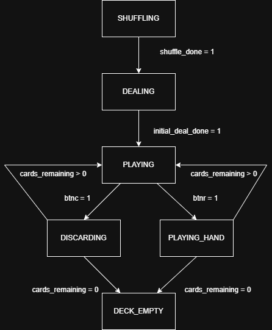
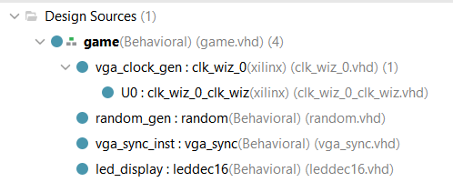

# CPE 487 Final Project - Simplified Balatro
**By: Nick Habakus and Victor Afonso**

## Project Overview

The goal of this project was to create a simplified version of the game Balatro using a Nexys A7 board and VGA display. The project replicated game mechanics such as drawing, playing, and discarding cards - as well as summing total score from played hands. 

### Main Aspects of Balatro:

- Player is dealt 8 random cards to his hand.
- From this point, they have the choice to select cards to either play them for points or discard them to receive new cards.
- Played hands will them we scored according to hand strength, using tradition 5 card poker hierarchy (Royal Flush, Straight Flush, Four of a Kind, etc.)
- If the player chooses to discard cards (Up to 5 max each time and only 4 times per game), they will receive the same amount of new cards in their hand as the number they discarded.
- Play ends when the player has played 4 total hands.  

### FSM Of Game Flow



## Required Hardware
For the game to work, you will need the following:
- Nexys A7-100T FPGA Board
  
  
  
- Micro USB cable
  
  
  
- HDMI Cable
  
  
  
- Monitor with HDMI Port
  
  
  
- AMD Vivado™ Design Suite

## Setup
Download all the VHD and XDC files from the repository to your computer:

Once you have downloaded the files:
1. Open **AMD Vivado™ Design Suite** and create a new RTL project called _Balatro_ in Vivado Quick Start
2. In the "Add Sources" section, click on "Add Files" and add all of the `.vhd` files from this repository
3. In the "Add Constraints" section, click on "Add Files" and add the `.xdc` file from this repository
4. In the "Default Part" section, click on "Boards" and find and choose the Neyxs A7-100T board
5. Click "Finish" in the New Project Summary page
6. Run Synthesis
7. Run Implementation
8. Generate Bitstream
9. Connect the Nexys A7-100T board to the computer using the Micro USB cable and switch the power ON
10. Connect the VGA cable from the Nexys A7-100T board to the VGA monitor
11. Open Hardware Manager
     - "Open Target"
     - "Auto Connect"
     - "Program Device"
12. Program should appear on the screen

## Module Hierarchy



## Inputs and Outputs

### `game.vhd`
```
entity game is
    PORT (
        clk_in : IN STD_LOGIC;
        VGA_red : OUT STD_LOGIC_VECTOR (3 DOWNTO 0);
        VGA_green : OUT STD_LOGIC_VECTOR (3 DOWNTO 0);
        VGA_blue : OUT STD_LOGIC_VECTOR (3 DOWNTO 0);
        VGA_hsync : OUT STD_LOGIC;
        VGA_vsync : OUT STD_LOGIC;
        btnr : IN STD_LOGIC;
        btnc : IN STD_LOGIC;
        SEG7_anode : OUT STD_LOGIC_VECTOR (7 DOWNTO 0);
        SEG7_seg : OUT STD_LOGIC_VECTOR (6 DOWNTO 0);
        SW : in STD_LOGIC_VECTOR(7 downto 0)
    ); 
end game;
```

#### Inputs

- clk_in : System clock
- btnr : Right button, used to "play" cards
- btnc : Center button, used to "discard" cards
- SW : Switches represented by vecotr, used to select cards
 
 
 #### Outputs
 - VGA_red: Controls red output to VGA screen
 - VGA_green: Controls green output to VGA screen
 - VGA_blue: Controls blue output to VGA screen
 - VGA_hsync: Horizontal sync signal for VGA display
 - VGA_vsync: Vertical sync signal for VGA display
 - SEG7_anode: Controls the anodes of the 7-segment display
 - SEG7_seg: Controls the segments of the 7-segment display

### `random.vhd`
```
entity random is
    Port (
        clock : in  STD_LOGIC;
        reset : in  STD_LOGIC;
        en    : in  STD_LOGIC;
        Q     : out STD_LOGIC_VECTOR (5 downto 0);
        check : out STD_LOGIC
    );
end random;
```

#### Inputs
 - clock: System clock
 - reset: used to reset lsfr to initial value 
 - en: Signal to advance the LSFR
 
 #### Outputs
 - Q: generated 6 bit vector
 - check: monitoring/debugging signal

### 'deck.vhd'

Package that includes

- Card definitions:
  ```
 	-- Card value
    constant CARD_2    : std_logic_vector(0 to 3) := "0010"; -- 2
    constant CARD_3    : std_logic_vector(0 to 3) := "0011"; -- 3
    constant CARD_4    : std_logic_vector(0 to 3) := "0100"; -- 4
    constant CARD_5    : std_logic_vector(0 to 3) := "0101"; -- 5
    constant CARD_6    : std_logic_vector(0 to 3) := "0110"; -- 6
    constant CARD_7    : std_logic_vector(0 to 3) := "0111"; -- 7
    constant CARD_8    : std_logic_vector(0 to 3) := "1000"; -- 8
    constant CARD_9    : std_logic_vector(0 to 3) := "1001"; -- 9
    constant CARD_10   : std_logic_vector(0 to 3) := "1010"; -- 10
    constant CARD_J    : std_logic_vector(0 to 3) := "1011"; -- 11 (Jack)
    constant CARD_Q    : std_logic_vector(0 to 3) := "1100"; -- 12 (Queen)
    constant CARD_K    : std_logic_vector(0 to 3) := "1101"; -- 13 (King)
    constant CARD_A    : std_logic_vector(0 to 3) := "1110"; -- 14 (Ace)

  	-- Card Suits
    constant SUIT_HEARTS : std_logic_vector(0 to 1) := "00";
    constant SUIT_DIAMONDS : std_logic_vector(0 to 1) := "01";
    constant SUIT_CLUBS : std_logic_vector(0 to 1):= "10";
    constant SUIT_SPADES : std_logic_vector(0 to 1):= "11";
  ```
  - And functions:
 	```
	 Function to generate cards
    function make_card(value : std_logic_vector(0 to 3);
                        suit: std_logic_vector(0 to 1)) return card_t;
                        
	 Function to get card value
    function get_value(card : card_t) return std_logic_vector;
    
    -- Function to get card suit
    function get_suit(card : card_t) return std_logic_vector;
    
    -- Function to check if card is valid
    function is_valid_card(card : card_t) return boolean;
    
     type hand_type_t is (HIGH_CARD, PAIR, TWO_PAIR, THREE_KIND, STRAIGHT, 
                         FLUSH, FULL_HOUSE, FOUR_KIND, STRAIGHT_FLUSH, ROYAL_FLUSH);
    
    -- Score record containing base value and multiplier
    type score_t is record
        value : integer;
        multiplier : integer;
    end record;
	
	-- Function to score hands
	function score_hand(h : hand) return score_t;
	
	-- Function to add the value of cards to score, like in Balatro
	function get_card_score_value(card : card_t) return integer;

  	```

  
   
## Modifications
We modified the contraints file pong.xcd to include the rightmost switches, as well as switching the order so that we count them from left to right:

	```
	set_property -dict { PACKAGE_PIN J15   IOSTANDARD LVCMOS33 } [get_ports { SW[7] }]; #IO_L24N_T3_RS0_15 Sch=sw[0]
	set_property -dict { PACKAGE_PIN L16   IOSTANDARD LVCMOS33 } [get_ports { SW[6] }]; #IO_L3N_T0_DQS_EMCCLK_14 Sch=sw[1]
	set_property -dict { PACKAGE_PIN M13   IOSTANDARD LVCMOS33 } [get_ports { SW[5] }]; #IO_L6N_T0_D08_VREF_14 Sch=sw[2]
	set_property -dict { PACKAGE_PIN R15   IOSTANDARD LVCMOS33 } [get_ports { SW[4] }]; #IO_L13N_T2_MRCC_14 Sch=sw[3]
	set_property -dict { PACKAGE_PIN R17   IOSTANDARD LVCMOS33 } [get_ports { SW[3] }]; #IO_L12N_T1_MRCC_14 Sch=sw[4]
	set_property -dict { PACKAGE_PIN T18   IOSTANDARD LVCMOS33 } [get_ports { SW[2] }]; #IO_L7N_T1_D10_14 Sch=sw[5]
	set_property -dict { PACKAGE_PIN U18   IOSTANDARD LVCMOS33 } [get_ports { SW[1] }]; #IO_L17N_T2_A13_D29_14 Sch=sw[6]
	set_property -dict { PACKAGE_PIN R13   IOSTANDARD LVCMOS33 } [get_ports { SW[0] }]; #IO_L5N_T0_D07_14 Sch=sw[7]

	```

## Original Code from scratch
### `deck.vhd`
#### Important Behavior - Scoring
The score checker works its way down from the best hand (Royal FLush) to the worst (High Card), checking each one via if statement. Generally each check is checking for a boolean, such as "is_royal".
```
    -- Main scoring Function
	function score_hand(h : hand) return score_t is
		variable counts : value_count_array := (others => 0);
		variable val : integer;
		variable has_pair : boolean := false;
        variable has_three : boolean := false;
        variable has_four : boolean := false;
        variable pair_count : integer := 0;
        variable three_val : integer := 0;
        variable four_val : integer := 0;
        variable pair_vals : integer := 0;
        variable is_flush_hand : boolean;
        variable is_straight_hand : boolean;
        variable is_royal : boolean := false;
        variable base_value : integer := 0;
        variable multiplier : integer := 1;
        variable card_sum : integer := 0;
        variable result : score_t;
        type bool_array is array (2 to 14) of boolean;
        variable present : bool_array := (others => false);
	begin
	-- Count occurences of each value
counts := count_values(h);

-- Populate present array from counts
for i in 2 to 14 loop
    present(i) := (counts(i) > 0);
end loop;

-- Check for pairs, three of a kind, four of a kind
for i in 2 to 14 loop
    if counts(i) = 2 then
        has_pair := true;
        pair_count := pair_count + 1;
        pair_vals := pair_vals + (i * 2);  -- FIXED: accumulate
    elsif counts(i) = 3 then
        has_three := true;
        three_val := i * 3;
    elsif counts(i) = 4 then
        has_four := true;
        four_val := i * 4;
    end if;
end loop;

-- Check for flush and straight;
is_flush_hand := is_flush(h);
is_straight_hand := is_straight(h);

-- Check for royal flush
if is_flush_hand and is_straight_hand then
    is_royal := present(10) and present(11) and present(12) and present(13) and present(14);
end if;
    
-- Determine hand type and scoring
if is_royal then
    base_value := 100;
    multiplier := 8;
    -- Add values of the cards in the hand
    card_sum := 10 + 10 + 10 + 10 + 11;
--Check for straight flush
elsif is_flush_hand and is_straight_hand then  -- FIXED: added elsif
    base_value := 100;
    multiplier := 9;
    -- Add value of cards to hand
    for i in h'range loop
            card_sum := card_sum + get_card_score_value(h(i));
    end loop;
	--Check for 4 of a kind
	elsif has_four then
		base_value := 60;
		multiplier := 7;
		card_sum := four_val;
	--Check for full house
	elsif has_three and has_pair then
		base_value := 40;
		multiplier := 4;
		card_sum := three_val + pair_vals;
	--Check for flush
	elsif is_flush_hand then
		base_value := 35;
		multiplier := 4;
		-- Add all card values
		for i in h'range loop
				card_sum := card_sum + get_card_score_value(h(i));
		end loop;
	-- Check for straight
	elsif is_straight_hand then
		base_value := 30;
		multiplier := 4;
		-- Add all card values
		for i in h'range loop	
				card_sum := card_sum + get_card_score_value(h(i));
		end loop;
	--Check for 3 of a kind
	elsif has_three then
		base_value := 30;
		multiplier := 3;
		card_sum := three_val;
	-- Check for 2 pairs
	elsif pair_count = 2 then
		base_value := 20;
		multiplier := 2;
		card_sum := pair_vals;
	--Check for pair
	elsif has_pair then
		base_value := 10;
		multiplier := 2;
		card_sum := pair_vals;
	-- Check for high card
	else
            -- High card
            base_value := 5;
            multiplier := 1;
            -- Add highest card value
            for i in 14 downto 2 loop
                if present(i) then
                    if i >= 11 and i <= 13 then
                        card_sum := 10;
                    elsif i = 14 then
                        card_sum := 11;
                    else
                        card_sum := i;
                    end if;
                    exit;
                end if;
            end loop;
        end if;
	result.value := base_value + card_sum;
        result.multiplier := multiplier;
        return result;
    end function score_hand;
```


## deck.vhd
#### Important Behavior - Game State Machine
The program is sorted into different states, from shuffling, to dealing, to playing, which can branch into either discarding or playing/scoring a hand. When one state is done, we move to the next. Playing, discarding, and playing_hand see the most interactivity among states.
```
-- Main game state machine
    process(clk_in)
        variable rand_pos : integer;
        variable temp_card : card_t;
        variable score_result : score_t;
        variable hand_score : integer;
        variable score_hand_input : work.cards.hand;
    begin
        if rising_edge(clk_in) then
            shuffle_counter <= shuffle_counter + 1;
            btnc_prev <= btnc;
            btnr_prev <= btnr;
            -- This is what dictates the flow of the game.
            -- We shuffle by randomizing a shuffle index, and then associating every card in the
            -- deck to a random position.
            -- To change the random order, see random.vhd
            case game_state is
                when SHUFFLING =>
                    if shuffle_counter(19 downto 0) = 0 then
                        if shuffle_index = 0 then
                            shuffled_deck <= deck;
                            shuffle_index <= 1;
                        elsif shuffle_index <= 51 then
                            rand_pos := to_integer(unsigned(Q)) mod (shuffle_index + 1);
                            temp_card := shuffled_deck(shuffle_index);
                            shuffled_deck(shuffle_index) <= shuffled_deck(rand_pos);
                            shuffled_deck(rand_pos) <= temp_card;
                            shuffle_index <= shuffle_index + 1;
                        else
                            shuffle_done <= '1';
                            game_state <= DEALING;
                            cards_drawn <= 0;
                            deck_index <= 0;
                            cards_remaining <= 52;
                        end if;
                    end if;
               -- Here we deal 8 cards to the player     
                when DEALING =>
                    if shuffle_counter(23 downto 0) = 0 then
                        if cards_drawn < 8 and cards_remaining > 0 then
                            hand(cards_drawn) <= shuffled_deck(deck_index);
                            cards_drawn <= cards_drawn + 1;
                            deck_index <= deck_index + 1;
                            cards_remaining <= cards_remaining - 1;
                        else
                            initial_deal_done <= '1';
                            if cards_remaining > 0 then
                                game_state <= PLAYING;
                            else
                                game_state <= DECK_EMPTY;
                            end if;
                        end if;
                    end if;
               -- Here is where we play. Center button takes us to the discard state, right to the playing_hand state     
                when PLAYING =>
                    if btnc = '1' and btnc_prev = '0' then
                        if selected_count > 0 and selected_count <= 5 and discards_remaining > 0 then
                            if cards_remaining >= selected_count then
                                game_state <= DISCARDING;
                                action_idx <= 0;
                            end if;
                        end if;
                    elsif btnr = '1' and btnr_prev = '0' then
                        if selected_count > 0 and selected_count <= 5 and plays_remaining > 0 then
                            game_state <= PLAYING_HAND;
                            action_idx <= 0;
                        end if;
                    end if;
                -- For every switch that is on, when btnc is pressed, those cards are removed and replaced/re-dealt    
                when DISCARDING =>
                    if shuffle_counter(20 downto 0) = 0 then
                        if action_idx < 8 then
                            if SW(action_idx) = '1' and cards_remaining > 0 then
                                hand(action_idx) <= shuffled_deck(deck_index);
                                deck_index <= deck_index + 1;
                                cards_remaining <= cards_remaining - 1;
                            end if;
                            action_idx <= action_idx + 1;
                        else
                            discards_remaining <= discards_remaining - 1;
                            if cards_remaining > 0 then
                                game_state <= PLAYING;
                            else
                                game_state <= DECK_EMPTY;
                            end if;
                        end if;
                    end if;
                -- For every switch on, that card is played, and it is scored as part of a hand. See deck.vhd for info on how
                -- hands are scored.    
                when PLAYING_HAND =>
                    if shuffle_counter(20 downto 0) = 0 then
                        if action_idx = 0 then
                            -- Build temp hand with only selected cards, rest are NULL
                            for i in 0 to 7 loop
                                if SW(i) = '1' then
                                -- We needed to make a temp hand to score, otherwise we'd be scoring the current hand
                                -- rather than the cards we are trying to play.
                                    score_hand_input(i) := hand(i);
                                else
                                    score_hand_input(i) := NULL_CARD;
                                end if;
                            end loop;
                            score_result := score_hand(score_hand_input);
                            hand_score := score_result.value * score_result.multiplier;
                            total_score <= total_score + hand_score;
                            action_idx <= 1;
                        elsif action_idx < 9 then
                            if SW(action_idx - 1) = '1' and cards_remaining > 0 then
                                hand(action_idx - 1) <= shuffled_deck(deck_index);
                                deck_index <= deck_index + 1;
                                cards_remaining <= cards_remaining - 1;
                            end if;
                            action_idx <= action_idx + 1;
                        else
                            plays_remaining <= plays_remaining - 1;
                            if cards_remaining > 0 then
                                game_state <= PLAYING;
                            else
                                game_state <= DECK_EMPTY;
                            end if;
                        end if;
                    end if;
                    -- Self explanatory,
                when DECK_EMPTY =>
                    null;
                    
            end case;
        end if;
    end process;
```

### `random.vhd`
#### Important Behavior - Random Vector Generator
This module generates a random 6 bit vector to be used in the shuffling of game.vhd. Note that in order to achieve a different shuffle order, you need to change the value of lsfr in this module.
```
 entity random is
    Port (
        clock : in  STD_LOGIC;
        reset : in  STD_LOGIC;
        en    : in  STD_LOGIC;
        Q     : out STD_LOGIC_VECTOR (5 downto 0);
        check : out STD_LOGIC
    );
end random;

architecture Behavioral of random is

    -- 6-bit LFSR state
    signal lfsr : STD_LOGIC_VECTOR(5 downto 0) := "001111";

    -- Free-running counter used as entropy source
    signal entropy_counter : unsigned(15 downto 0) := (others => '0');

    -- Ensures seeding happens once after configuration
    signal seeded : STD_LOGIC := '0';

begin

    process(clock)
        variable feedback : STD_LOGIC;
    begin
        if rising_edge(clock) then

            -- Always increment entropy counter
            entropy_counter <= entropy_counter + 1;

            -- Seed LFSR ONCE using power-up timing uncertainty
            if seeded = '0' then
                lfsr <= "001111";
                seeded <= '1';

            elsif reset = '1' then
                -- Optional external reset (can be tied low)
                lfsr <= "001111";

            elsif en = '1' then
                -- LFSR polynomial: x^6 + x^5 + 1
                feedback := lfsr(5) xor lfsr(4);
                lfsr <= lfsr(4 downto 0) & feedback;
            end if;

        end if;
    end process;

    Q     <= lfsr;
    check <= lfsr(0);

end Behavioral;
```


## Conclusion

### Responsibilities

#### Victor Afonso
- Created the state machine in game.vhd and the deck module.
- Base visuals
- Contributed to GitHub repository

#### Nick Habakus:
- Designed the numbers to appear on screen
- Debugging and code organization
- Outlined how to achieve randomness
- Contributed to GitHub repository

### Timeline of Work Completed
- First week
  - Base outline decided on. Originally was to be a poker game playing against an "opponent"
  - Began work of deck module
- Second week
  - Shifted gears to Balatro 
  - Selection feature implemented
  - Preliminary numerical designs
  - Beginning work on random module and state machine
- Third week
  - State machine finalized
  - Deck functions finalized
  - Card designs finalized
  - Scoring tied to LED display
  - Worked with port mapping and component instantiation
  

### Difficulties 
-Card designs
	- Numbers would appear really, really odd, sometimes just being unrecognizable or not appearing at all.
	- Solution: Trial and error.
- Randomness
  - When we started dealing with this, we were creating decks that were entirely a single card, ie a deck of 52 queens. When we got past that, we were still seeing
  - some duplicates
  - Solution: Downsizing the random vector being generated from 8 to 6, and ensuring that generation for each card happened on different clock cycles rather than all in one.
- Scoring
  - When playing hands, the algorithm would score the entire hand rather than what was being played
  - Solution: Creating a temporary hand at the moment of play, filling it with the cards selected and the rest of the spaces null. This hand would be passed into the scoring function.
